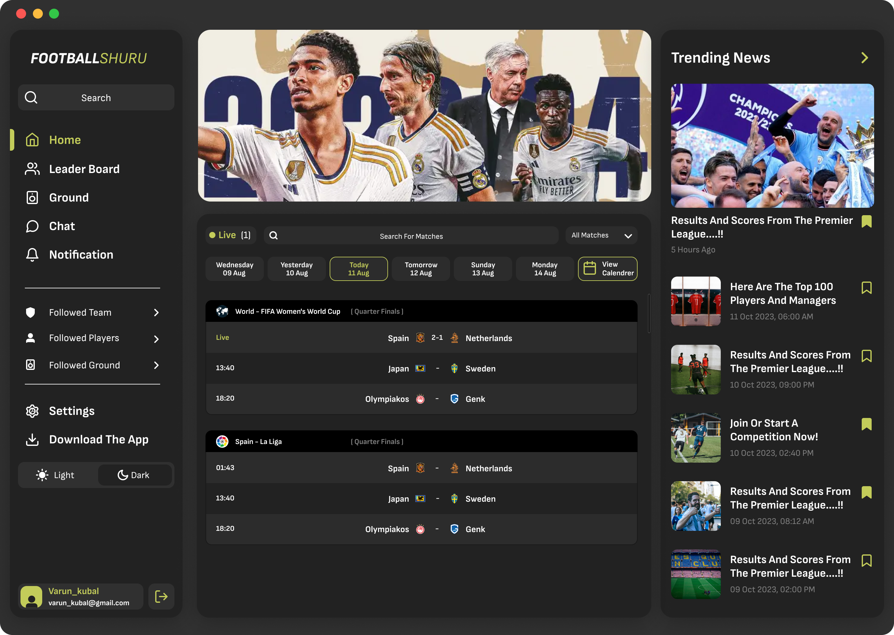

# Footballshuru

Footballshuru — веб-интерфейс футбольной платформы, разработанный на React. Проект представляет собой информационный интерфейс для просмотра футбольных матчей, навигации по разделам платформы и управления пользовательскими настройками.

## О проекте

Проект реализует интерфейс футбольного сервиса с боковой навигацией, поиском матчей, отображением текущих игр и различными пользовательскими настройками.

В интерфейсе реализованы:

* боковая навигация по основным разделам сайта;
* выделение активного пункта меню;
* поиск по матчам и командам;
* отображение количества уведомлений;
* автоматическое увеличение счётчика уведомлений;
* переключение между светлой и тёмной темой;
* пользовательский профиль и взаимодействие с кнопкой выхода;
* окно подтверждения выхода из аккаунта;
* отображение списка футбольных матчей;
* разделение матчей по лигам и турнирам;
* отображение команд, счёта и времени начала матча;
* выделение матчей, проходящих в прямом эфире;
* построение интерфейса на основе массивов данных и React-компонентов.

Проект построен с использованием компонентного подхода React: отдельные элементы интерфейса вынесены в самостоятельные компоненты, а состояние и взаимодействие между ними реализованы с помощью `useState` и `useEffect`.

## Технологии

* React
* JavaScript
* Vite
* HTML
* CSS
* Font Awesome

## Цель проекта

Цель проекта — практика разработки сложного интерактивного frontend-интерфейса на React.

В процессе разработки были отработаны навыки:

* создания компонентной архитектуры;
* работы с `useState` и `useEffect`;
* передачи данных через props;
* обработки пользовательских событий;
* фильтрации и поиска данных;
* условного отображения элементов;
* управления состоянием интерфейса;
* реализации переключения светлой и тёмной темы;
* работы с динамическими списками через `map()`;
* создания интерактивных элементов пользовательского интерфейса.

## Скриншот проекта



## Дизайн в Figma

[Открыть макет Footballshuru в Figma](https://www.figma.com/design/MLvo8t8Wds3mGr0TVndQHi/Football-Score-Website--Community---Copy-?node-id=0-1&t=o3BupT0eoywEwKi3-1)

## Запуск проекта

### 1. Клонирование репозитория

```bash
git clone https://github.com/voidlord96-rgb/Football-Score.git
```

### 2. Переход в папку проекта

```bash
cd Football-Score
```

### 3. Установка зависимостей

```bash
npm install
```

### 4. Запуск проекта

```bash
npm run dev
```

После запуска откройте адрес, который Vite покажет в терминале, обычно:

```text
http://localhost:5173/
```
